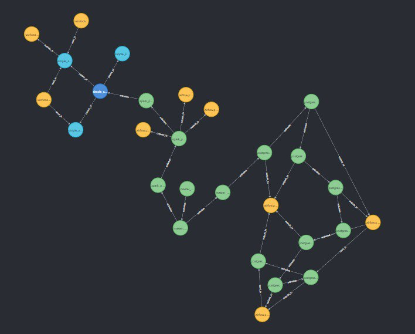

Data-lineage-dbz is a data lineage engine that leverages on open-source technologies to provide a visualisation of task-level and table-level lineages for Airflow DAGs and Spark Jobs within a data ecosystem.

It leverages upon the OpenLineage standard of metadata produced by producers to capture and visualise lineage information on the graph database Neo4j.

